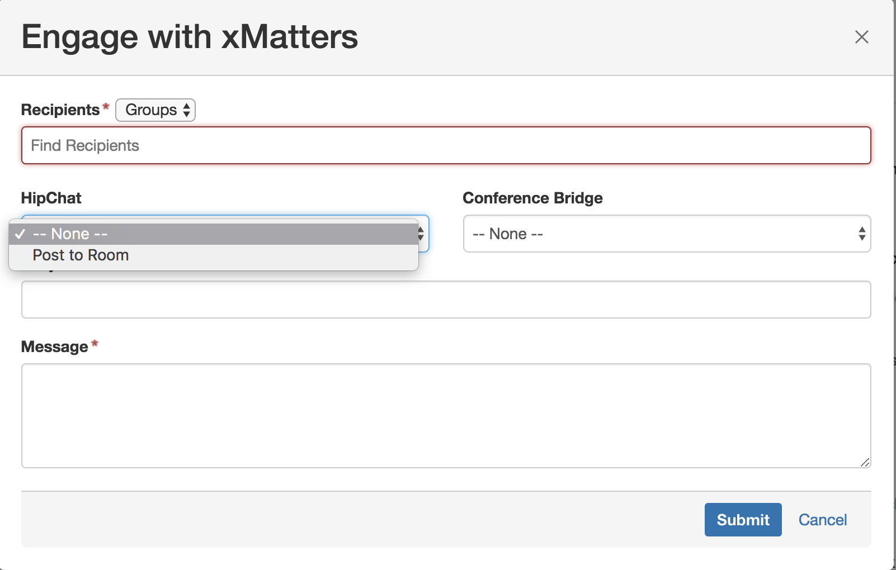
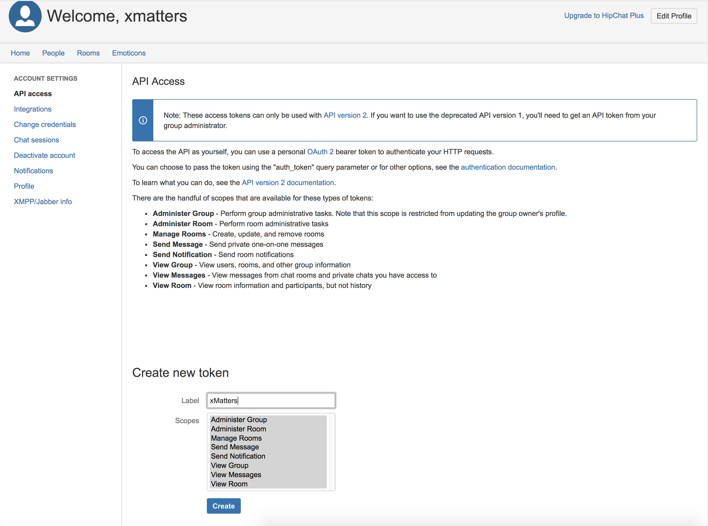

# Jira Server - Chat
This is a replacement to the existing [Jira Server](https://www.xmatters.com/integration/jira-server/) integration. This version adds a drop down to the engage panel for an option to post to a chat room. The code assumes the chat room name will match the Jira issue number. 

<kbd>
	
</kbd>

<kbd>
  
</kbd>

# Pre-Requisites
* Version 7.3 of Jira Server
* xMatters account - If you don't have one, [get one](https://www.xmatters.com)!

# Files
* [xmatters-1.0.2.CHAT-BRANCH.jar](xmatters-1.0.2.CHAT-BRANCH.jar) - Jar file containing the integration

# How it works

# Installation
Make sure you don't have the existing xMatters integration for Jira Server installed. 

## Retrieve HipChat Token

1. Login to HipChat and navigate to the `Account Settings` page. Click on `API access`. 
2. In the Create new token section, select all the scopes and give it a label, such as `xMatters`. 

<kbd>
  
</kbd>

(Note, this will tie the token to your user account, if that is undesirable, create a new user, login as that user and then generate the token as below.)

3. Copy the token value for later. 

## xMatters set up

Follow the steps outlined in the normal [Jira Server integration guide](https://support.xmatters.com/hc/en-us/articles/215190563#configure_xmatters). 

Then, update the constant named `HipChat Token` with the token value from above. Additionally, update the `HipChat` endpoint with the url for the HipChat instance and select Basic for the authentication and enter the username and password used to retrieve the HipChat token. 

## Jira set up
Navigate to the Administration section > Add-ons > Manage Add-ons and click the Upload add-on link. 

Download the [xmatters-1.0.2.CHAT-BRANCH.jar](xmatters-1.0.2.CHAT-BRANCH.jar) and keep handy.

Follow the rest of the instructions [here](https://support.xmatters.com/hc/en-us/articles/215190563#option-2-download-jar-file)

# Testing
To test the integration, create an issue that will match the criteria selected in the webhook. This will initiate an event to xMatters and notify the recipients designated in the Issue Assignment form. 

# Troubleshooting
Some suggestions for troubleshooting can be found in the [Jira Server integration](https://support.xmatters.com/hc/en-us/articles/215190563#troubleshooting)

